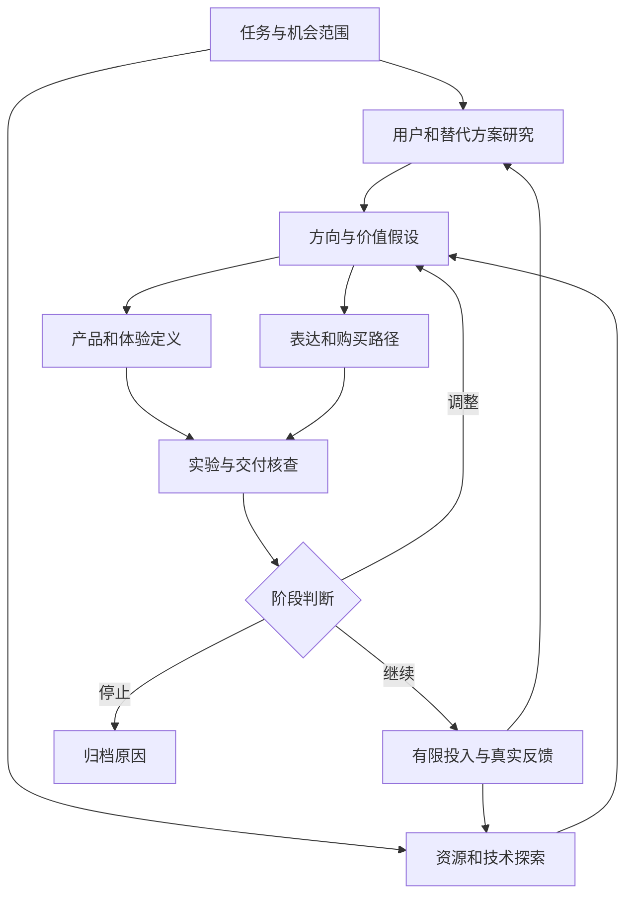

# 工作流程

## 工作关系

这些是任务依赖，并不要求团队人数或多个模型代理。首版为单一工作流Agent：模型分析，程序检查，人作投入决定。

|阶段|关键输入|Agent工作|人的工作|输出与关口|
|---|---|---|---|---|
|任务界定|目标、现状、预算、能力|整理决策范围与缺失项|确认问题、权限与资源|任务书；信息不足可先限定范围|
|并行研究|人群场景、替代方案、技术能力|整理差异、矛盾、机会与反例|采集并核实真实资料|需求与能力两张清单|
|形成方向|研究结果|按适用机制形成默认最多3个方向及实现草案|选择值得测试的关键未知|完整方向卡；允许全部不选|
|定义方案|候选方向|联动产品范围、体验、表达、购买与经济假设|核查技术、交付与成本|方案与承诺一致；不足处明确|
|设计实验|关键未知|匹配最低必要成本的测试、对照及指标|约定阈值并组织真实参与者|事前实验卡与停止条件|
|导入反馈|测试、询价、使用、交易记录|整理结果、反证，重新判断|确认数据、口径与局限|新增证据与新版本结论|
|投入与复盘|完整判断与条件|保留历史、比较假设与结果|批准、调整或停止投入|可复用经验及失效条件|

## 项目状态

`init` 创建任务和证据 → `prepare` / `run` 分析 → `import-analysis` / API响应执行校验 → 输出报告及历史 → `add-evidence` 追加结果 → 旧报告过期 → 重新分析。

每次成功分析保存输入快照、候选方向、实验和判断。`input_digest` 将回答绑定到输入版本；输入变化后旧JSON不能重新导入为当前结论。模型会看到前次分析，并应保持已有方向ID。

## 实验如何衔接

- 问题不清：观察当前行为并访谈，找实际代价与反例。
- 差异不清：同等呈现、保留现方案、轮换顺序，记录选择理由。
- 使用不清：纸模、交互原型或实物任务测试；记录失败而非只问喜欢。
- 实现不清：关键技术验证、报价与样品核查。
- 付费不清：在明确价格和交付条件下观察真实购买承诺与交易。
- 持续价值不清：观察重复使用、退换、续购及完整服务成本。

测试结果以新证据条目加入。要写明对应方向、维度、原实验、指标、样本、结果及局限；`source` 指向实际记录位置，`statement` 可摘要，不能丢掉相反结果。
